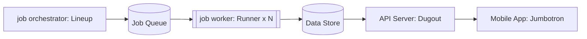
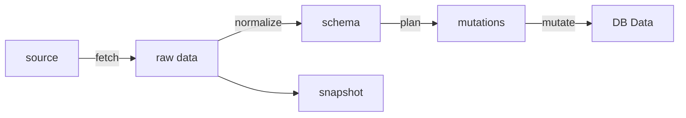
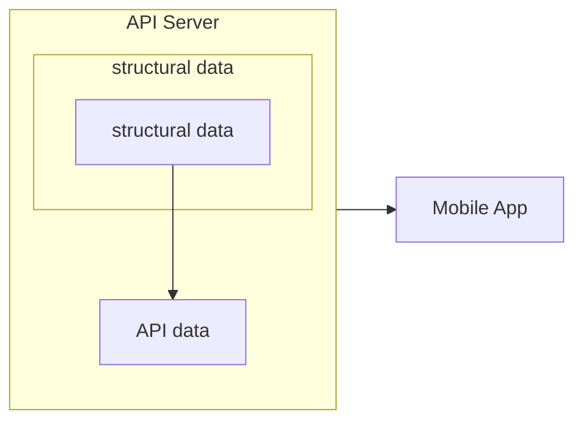

## Table of Contents

- [Table of Contents](#table-of-contents)
- [專案介紹](#專案介紹)
  - [專案定位](#專案定位)
  - [核心問題與決策](#核心問題與決策)
    - [Decision Principles](#decision-principles)
    - [Deliberate Non-goals](#deliberate-non-goals)
- [系統架構](#系統架構)
  - [架構設計與方向](#架構設計與方向)
    - [任務分配與執行](#任務分配與執行)
    - [資料處理流程](#資料處理流程)
    - [資料的分離點設計](#資料的分離點設計)
  - [資料儲存策略](#資料儲存策略)
- [Tooling Decision](#tooling-decision)
- [系統演進決策](#系統演進決策)
- [Get started](#get-started)
    - [setup](#setup)
    - [lineup](#lineup)
    - [runner](#runner)
    - [dugout](#dugout)
    - [jumbotron](#jumbotron)
- [Misc](#misc)
    - [棒球 ID 設計](#棒球-id-設計)
    - [模組資源化](#模組資源化)
- [Current status](#current-status)
- [Learnings](#learnings)
- [Tales](#tales)
- [Appendix](#appendix)

## 專案介紹

> [!TIP]
> Sports Data Crawler & App Infrastructure Prototype: **Bandwagon** 

設計一個**從資料來源不穩定的爬蟲，到可供 App 呈現的資料服務**，用來支援即時與非即時的體育賽事資料。以**棒球**賽事進行設計，並以中華職棒的資料進行開發。

### 專案定位

這並非完整的產品，更像是一個開發架構的實驗，目標是在現實資源有限的條件下，建立可演進的架構。這樣的前提，需要面對以下問題：

- 服務如何拆分
- 資料生命週期如何規劃
- 部署經濟成本控制
- 開發人力成本分配
- 應用 / 服務可演進性

下面會解釋面對這些問題的策略以及決策

### 核心問題與決策

這樣的目標下，有兩個核心問題需要被考量：資源限制以及領域特色。在資源限制部分：

1. 團隊規模極為有限：1 人
2. 開發資金極度不足：2000 NTD 月以下

而在體育賽事資料應用這樣的領域，會有這樣的特色：

1. 資料來源易便、多樣：例如第三方網站爬取、人工更新、串流賽事辨識等
2. 不同資料對「即時性」的需求不同
3. 爬蟲任務需要容錯、重試、排程
4. 系統初期不完全需要高併發，但需要穩定與未來的擴充性
5. 前端與資料來源不一定會同步，如何解耦的彼此的相依性

基於這些挑戰，發展出以下決策原則

#### Decision Principles

- 優先降低維運經濟成本
- 優先以短期學習成本換取長期迭代成本
- 優先以系統能力抵抗意外狀況
- 不為未來假設優化，但保留可能性
- 保留架構擴展性，但穩定抽象
- 依需要逐步引入系統架構實作

#### Deliberate Non-goals

- 不追求高併發
- 不追求完整服務
- 不追求 tooling
- 不追求短期需求
- 不追求一次完成架構

## 系統架構

- 後端 Services：[Scout](/scout)
    - job orchestrator：[Lineup](/scout/services/lineup)
    - job worker (data pipeline)：[Runner](/scout/services/runner) 
    - API server：[Dugout](/scout/services/)
- 前端 App：[Jumbotron](/jumbotron-flutter)




### 架構設計與方向

架構設計包含以下部分：
1. 任務分配與執行
2. 資料處理流程 (date pipeline)
3. 資料的分離點設計

#### 任務分配與執行

- job orchestrator：爬蟲任務任務統一由中央 orchestrator 管理，包含任務排程、調度、任務重試策略、錯誤處理
- job worker：無狀態，可水平擴展的服務。依照不同任務性質交由不同的 worker 執行，來滿足需求。
    - stable worker：處理時間敏感度高的資料，例如即時的賽事資料更新
    - best-effort worker：處理定時更新，但非即時的資料，例如比賽時程，球員資料等

將任務進行分層可以有效降低部署成本以及增加可擴充性。例如非即時資料可以使用 Spot VM 來降低伺服器成本開銷。而即時資料可以依照流量作水平擴展，例如因應重要賽事擴增新增 Server。

#### 資料處理流程




將資料處理階段「解耦」成以上階段，讓每個步驟可重試、冪等、不互相耦合。讓任務之間解耦，易於迭代、除錯、並可獨立開發，面對不穩定的資料來源更加有韌性

詳細設計介紹請參考：[資料處理流程](/scout/README.md#資料處理流程)

#### 資料的分離點設計

資料以 API server 作分離點

- structural data 
    - 以「資料完整性」出發來設計資料結構
    - 透過 Data pipeline 的終點，將資料儲存進入 DB
- API data Schema
    - 以「介面」為出發點設計資料結構
    - 可以依照介面需求，不同 endpoint 作分級的 cache (CDN)
        - 例如：賽事比分資料時效短；反之球員資料 TTL 極長，且無須即時
- 轉換層：API Server
    - 在 data pipeline 有調整時，調整 API Server 以維持 API 介面一致性
    - 在介面有需要時，調整 API Server，組合資料以滿足前端資料內容




### 資料儲存策略

在整個應用中，有以下幾個資料儲存的需求

- 主結構化資料：賽事比分、賽事事件、球賽資訊、球員資訊等
- jobs data：Job orchestrator 發出的任務內容
    - 讓 worker 能夠去狀態化，更利於重啟、重試等
- pipeline audit
    - 以 data pipeline 階段為單位，紀錄執行狀況
    - 用以爬蟲的重試、回放、稽核資料問題
- snapshot：從資料員爬取，全位處理的資料
    - 例如 http response, 甚至是二進制資料
    - 供事後審計、開發、replay 用


|                 | schema<br>Shape | schema Evolution   | R/W ratio                    | retention  | 適合的 Store 類型         |
| --------------- | --------------- | ------------------ | ---------------------------- | ---------- | -------------------- |
| Structural data | Structured      | Compatible         | Read-heavy                   | long life  | Document Store       |
| Job data        | Structured      | Additive evolution | Write heavy                  | short life | Relational Store     |
| Pipeline audit  | Structured      | Additive evolution | Write heavy, <br>append only | archive    | Relational Store     |
| Source Snapshot | Unstructured    | Additive evolution | Write heavy                  | archive    | Unstructured Storage |


## Tooling Decision

- job queue: Redis / BullMQ
    - 適合早期迭代，內建基本的 retry, error handling policy
    - 何時更換：在未來 services 之間交互更加複雜，吞吐量更高，以及希望有更高的可靠度時，可以引入更複雜的 message broker 服務來實作
- Database: Postgres
    - 周邊擴充生態完整，具有強查詢以及遷移等能力。並且在 TS 生態工具鍊完整 (ORM)、型別友善
    - 何時更換：若有更複雜 Query 需求，可以引入其他類型資料庫，但 Postgres 仍作 SSOT
- Snapshot: GCS: 
    - 便宜、持久、policy 設定完整
    - 何時更換：如果有需要 query snapshot，可以儲存 metadata 在 Postgres
- Services: GCE + Spot VM + Cloud run ([server 服務類型考量](infra/README.md#server-服務類型考量))
    - 依照需求分層使用，最低限度滿足擴展需求，並利用 SpotVM 降低開銷
    - 何時更換：如果流量分層、或擴展策略更加複雜，可以使用統一的 orchestrator (K8s / GKE)
- Mobile Development Platform: Flutter ([前端應用框架考量](jumbotron-flutter/README.md))
- IaC：Docker, Terraform ([手動部署至 IaC 演進](infra/README.md#手動部署---iac-的演進決策))
- Programming Language: Typescript
    - 整個 pipeline 能用同樣的語言完成，且強型別在開發上友好
    - 何時更換：若有必要，不同 pipeline stage 可以獨立成 service，能夠使用個別團隊熟悉的開發環境、語言（例如更常使用的 python）

## 系統演進決策

| 階段  | 狀況       | 引入抽象                                            |
| --- | -------- | ----------------------------------------------- |
| MVP | 單一資料來源   | data pipeline 階段合併：normalize + plan 結合          |
| 成長期 | DB 複雜度上升 | 分離資料操作： mutate & mutations                      |
|     | 爬蟲資訊量大   | 切分 stable job worker / best-effort job worker   |
|     | 資料操作複雜   | normalize + plan 分割                             |
|     | 重現資料變更困難 | 切分階段且儲存  snapshot, schema, mutations 等 job data |
| 成熟期 | 維運成本上升   | 引入資源化                                           |
|     | 多服務管理複雜  | 引入 Container management                         |


## Get started

#### setup

- install pnpm
- install redis 
- install package: `pnpm install`


#### lineup
```
cd scout

pnpm start:dev:lineup
```

#### runner
```
cd scout
pnpm start:dev:runner
```

> [!NOTE]
> Please start redis server first when start lineup and runner service

#### dugout
```
cd scout
pnpm start:dev:dugout
```


#### jumbotron

> [!NOTE]
> Please install [FLutter](https://docs.flutter.dev/install) first

```bash
cd ./jumbotron-flutter
flutter pub get
flutter run -d <replace-this-devices-id> --flavor freeDevelopment
```

## Misc

#### 棒球 ID 設計

棒球規則比起其他運動複雜，賽事類型也比其他運動更多樣。如果需要完整的紀錄賽事、事件，一套完整的 id 系統是基礎。可以參考 [棒球資訊 ID 設計](/scout/shared/utils/types/id/README.md)

#### 模組資源化

把資料處理過程分成多個階段，能帶來迭代更加快速的好處。隨著資料來源、資料操作、輸出的資料更加複雜、多樣，下面能力的重要性會愈加凸顯

- 不同版本的並行能力
- 追溯資料來源的能力
- 錯誤的定位能力

透過[模組資源化](/scout/shared/resource/README.md)，可以讓完整讓系統發展上述的能力

## Current status

- services
    - [x] orchestrator
        - serve on spot-VM
    - [x] stable worker
        - serve on spot-VM
    - [ ] best-effort worker
    - [x] data server
        - serve on Cloud run
- pipeline 
    - 完成 fetch, normalize, plan, mutate 的切分，固定 schema 的格式
- 資料儲存
    - [ ] snapshot
    - [ ] job data
    - [x] structural data (firestore)
- mobile app
    - [/] game info page
    - [x] Calendar page
    - [ ] team info 
    - [ ] player info 
    - [ ] main page
- misc
    - [/] [模組資源化](/scout/shared/resource/README.md)

## Learnings

做了這麼多，學到了什麼？

這次接觸的領域橫跨 data pipeline、backend、infra、mobile。這些技術表面上差異巨大，但當真的把手弄髒時，好像都在想類似的事：

> 資料如何流動？邏輯如何被描述？狀態如何被控制與管理？

每個領域都有各自適合的方式在解決問題，能走一遍真的是很有趣的事。這不是為了挑戰、也不為學習更多技術，而是更完整理解系統運作。此外，在過程中遇到了很多抉擇：

- 在預算限制下選擇 Spot VM，帶來的是設定與可靠性的複雜度
- 在開發速度優先時選擇 Firestore，帶來的是 migration 的痛苦
- 在資料流切分的分界也常常懷疑是太早還是太晚
- ...數不勝數

這些問題，看起來風馬牛不相及。但當把技術的殼剝掉，剩下來的是：

> 這個抽象，是為了解決現在的問題，還是為了未來的假設？它的成本，是否值得？

單人開發、預算限制、資料來源的不確定性、現實棒球規則的複雜性，和時間的迭代之下，這些命題格外的赤裸。

忘記在哪裡看到的，在職涯中一直在咀嚼的一句話：

> 軟體本質上是需求的實現，但需求是不確定的、且易變的，而抽象正是管理的工具

理解它的路還很長，但好像聞到了一點味道：不只把抽象當成優雅和品味，而是主動的選擇邊界和耦合，來操作穩定與彈性

## Tales

各個服務的名稱是有由來的：

- 專案名稱：Bandwagon
  - 來自於 Bandwagon fan - 一日球迷、跟風球迷的意思
- 後端 Services：Scout
  - 來自自於球探 - scout
- job orchestrator：Lineup
  - Lineup 在棒球中是打擊順序的意思，依序上場（消化）的感覺跟任務很像
- job worker：Runner
  - Runner 在棒球是打者的意思，同時雙關執行 (run) 的角色
- API server：Dugout
  - Dugout 是指球員的休息區，作為 API server 有一點把資料送出（派出）的意味在
- 前端 App：Jumbotron
  - Jumbotron 是指球場的超大螢幕，跟前端一樣用來「展示資訊」

## Appendix 

- [棒球比賽資訊 ID 設計](/scout/shared/utils/types/id/README.md)：棒球事件的 id 設計概念與實作
- [Infra](/infra/README.md)：介紹 infra 與 cloud service 的選擇決策
- [前端應用框架考量](/jumbotron-flutter/README.md)：RN 與 Flutter 之間的權衡
- [模組資源化](/scout/shared/resource/README.md)：爬蟲服務複雜度上升的解決方案
- [設計稿 Figma](https://www.figma.com/design/h0o9n2hKeXln9gU8SJ2yxD/Bandwagon?node-id=0-1&t=OU3oXjkkhYOLzdBw-1)：App icon, Calendar page, Game page 
- [notion 文件](https://www.notion.so/Development-21d1c0dfd7df80f19b6acc8d8ad34ecc?source=copy_link)
    - [Data store 估算](https://www.notion.so/Data-Store-49483892be874b9780513937a79360b0)：估算成熟的服務需要承擔多少流量與金錢成本


