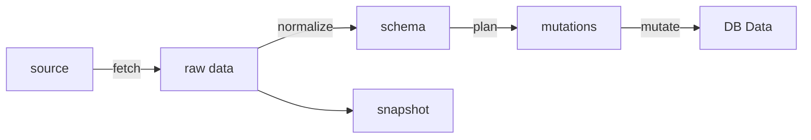

## Scout

### 資料處理流程

將資料處理階段「解耦」，讓每個步驟可重試、冪等、不互相耦合。分成幾個階段

- fetch：從資料來源（例如網站等）擷取後，成為未處理過的資料
    - 擷取到資料後，會在這個階段作 snapshot，供除錯以及未來開發作使用。
- raw data: 直接從資料來源獲取的資料，完全不經過處理  
    - 例如爬蟲來源是網頁 or API =>  response 的內容
    - 如果爬蟲來源是影片 => blob file
- normalize：將資料處理後，轉換成與主資料結構強關聯的格式
    - 解析 raw data 後，進行資料清洗、驗證資料格式
    - 這個階段不與既有資料進行比對 / 計算，目的是把 raw data 變成可以使用的「原料」
- schema：切割外部資料與內部資料的中間格式
- plan：將「原料」轉換成數個 mutations 的步驟
    - 與既有資料結合、比對，產生變更的結果，例如將 delta 與現值比對產生需要寫入的值
    - 拆解資料內容，分解成不同的 table 的操作
    - 不處理「寫入」的任務，整個 plan 為 pure function，測試上穩定且版本容易確定
    - 有能力對 diff 作額外維度的分析
- mutations: 對內部資料的操作以及操作的內容
- mutate：實際執行前面所規劃的「操作」
    - 在儲存的服務有問題時，可回放、可審計，而不需要重新計算
    - 當資料受到污染時，能清楚知道 diff，而不需要從資料來源除錯
    - 在更新 stale 時，可以直接在這層級作丟棄

### 架構優勢 / 成本權衡

這樣的架構帶來幾個優勢

- 可以自由將任務拆分到不同 service，並透過中央 job orchestrator 分配，可使用更有效率的機器執行而不互相阻塞
- 每個流程可自由進行重試 / 取消而不影響其他階段執行
- 每個環節內部可獨立開發，並能夠替換任一環節的工具鍊而不互相影響
- 可回放、可重試，不論是資料上游來源有問題，或者是 DB 有狀況，都不影響整體服務的運行
- 可觀察、可回溯。能夠快速定位，易於除錯並利於快速迭代，有效面對不穩定的資料來源
- 外部內部資料解耦，不論是外部資料結構變化，新增來源，都不影響內部結構。反之如果內部結構要調整，依然可以使用同樣的邏輯。

反之也有需要付出的成本：

- 開發複雜度急劇上升，每個開發人員都需要有**架構上的共識**
- 每個階段之間都需要 contract，而 contract 的定義並不容易，改動更是會大幅影響階段間的協作

可以先以團隊 convention, code review, logging 為基礎解決問題，如果更加複雜，再考慮引入[資源化](/scout/shared/resource/README.md)

### 引入抽象的時機

那要如何保持這個架構的優勢，又管控成本？問題在於引入抽象與分層的時機。在專案初期，引入如此分離的架構不一定是值得的。

- 在初期 normalize 跟 plan 這兩個階段可以合併，直接產出資料操作，早期分離並沒有太大的效益。
- 反之，fetch 先引入是好的，引入 snapshot 對未來的儲存、開發都很有價值，而先分出這個抽象的成本相對較低，source data 與後續的資料處理並沒有複雜 contract 的問題。
- 從 MVP 進入發展階段，mutate 是另一個值得作的部分，在產品穩定及發展壯大後，勢必會遇到 DB 成本、吞吐量、多資料庫同步問題。抽出 mutate 能讓資料庫的更換、遷移更有彈性

這些階段並不是死的，但根本的決策是：引入這個抽象解決的了什麼問題？能否用短期的轉換成本換取長期的迭代、服務穩定。