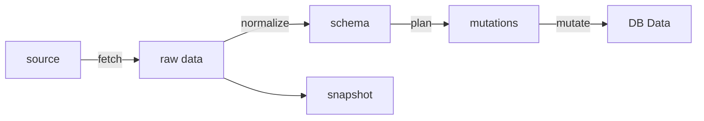

## 模組資源化

在有提到將資料處理過程分成多個階段，可以加速迭代

但當複雜度上升、團隊成長、服務來源更多樣化時，連帶也會造成幾個問題：

- 不同模組版本演進、依賴極其複雜，契約（中間格式）會變成瓶頸，格式一動上下游就需要調整
- 舊的 snapshot 或者 job data 無法相容新的 pipeline，導致重現/重試價值降低
- 如果資料受到污染，pipeline 卻已經演進，導致無法確定到底是什麼版本出現錯誤
- log、錯誤訊息不清楚當前的版本，難以除錯

可以透過團隊規範、共識來解決這些問題，但非長久之計。人會犯錯，從系統層面下手會是比較合適的作法。為此，可以試著導入資源化的概念。在整個 pipeline 中，有幾個流程 & 契約(中間格式)

- 流程
  - fetch
  - normalize
  - plan
  - mutate
- 契約
  - raw data
  - schema
  - mutations

資源化意味著把每個部分都視為「資源」，而不同的資料流，則視為這些資源的組合

每一個資源都有
- canonical id 
  - semantic id：基於語意，人工進行的版本定義。一個版本意味著行為上有變動
  - fingerprint：自動產生，透過 git hash, code hash, 以及 dependencies id 產生
- logging
  - error report
  - logs
- metadata
  - tag: 例如 mlb, cpbl, global 等資訊
- module definition
  - description
  - name

具有這些資訊的資源組合成 pipeline，能讓系統具有這些能力

- pipeline 可以完全清楚組成的模組，甚至可以用 graph 的方式呈現
- 所有的資料都有可以追溯的來源，可以精確使用的模組、版本
- log 不只是資訊，可以清楚定義到 pipeline 的階段、版本
- 能讓 metric 更顆粒化，像是個別模組的 success rate
- 在錯誤時，能更精確的重試特定的模組版本

### 實作

- fingerprint 產生：[generate.ts#getFingerprint](generate.ts)
- module definition：[resource.ts#ResourceInfo](resource.ts)
- 各類 resource 定義：[schema.ts](scout/resources/schema/schema.ts)
- resource instance 範例：[schemas/game/game.resource.ts](/scout/resources/schema/schemas/game/game.resource.ts)
- resource metadata 範例：[schemas/game/game.resource.json](/scout/resources/schema/schemas/game/game.resource.json)

透過指令 `pn run script:resource-generate`，指定副檔名為 [`.resource.ts`](/scout/resources/schema/schemas/game/game.resource.ts) 的檔案，能夠產生對應的 [resource 資訊](/scout/resources/schema/schemas/game/game.resource.json)。而 pipeline 則使用 `resource.ts` 使用資源

### 什麼時候應該引入「資源化」？

這才是最重要的問題，這裡列出幾個比較熟悉的指標：

- pipeline 的維護時間大於開發與功能迭代的時間
- pipeline 出問題時，定位問題比「解決」問題還要花時間時
- 當上一個 pipeline 問題還沒解決，但下一個問題又發生，導致上一個問題沒辦法釐清時

### 如何漸進式引入資源化

資源化不一定要一次引入，需要考慮成本、價值、開發階段漸進的引入。也需要配合到 [data pipeline 開發階段](/scout/README.md#引入抽象的時機)

- 初期：成本較低，以及資料 input / output 作
  - fetch => 成本低，通常只有 url, body, method 
  - raw data => 儲存在 snapshot 需要有版本才有意義
  - mutations => 事後稽核資料變更結果的重要階段
- 中期：針對資料操作過程
  - schema => 這在整個 pipeline 是最重要的中間格式
  - normalize, plan => 這是 data pipeline 最常出錯的部分
- 後期
  - mutate => 初期通常資料庫操作較單純，重要性較低

資源化的功能也能夠漸進的引入

- 初期
  - 讓模組引入語意資訊
    - 每個流程模組建立 semver ID
    - name, description
  - 獨立 pipeline 的各個流程的 logger / error report
  - log 紀錄 semver 資訊
  - 定義由模組資訊組合成的 pipeline id
- 中期
  - 更完善資訊： tag, metadata, 語意的 deps 紀錄等
  - CI/CD 中引入相關資訊暴露、檢查
  - 在部署時紀錄 pipeline, 模組資訊
- 後期
  - 在組引入 fingerprint，包含模組
  - 自動化的 deps id 計算
